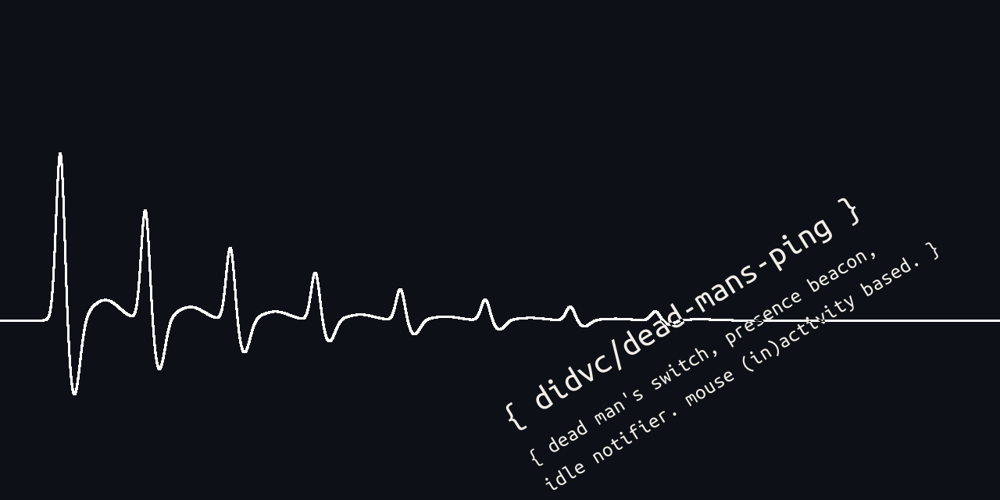
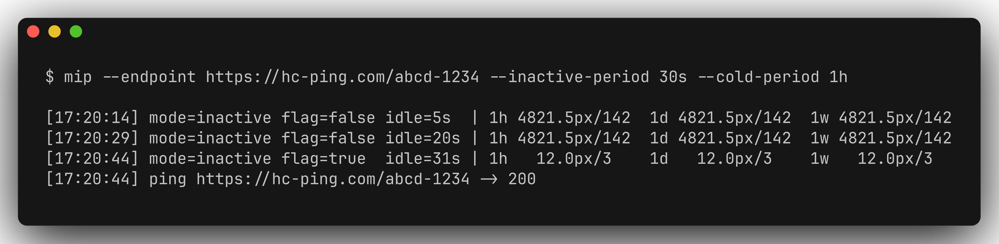
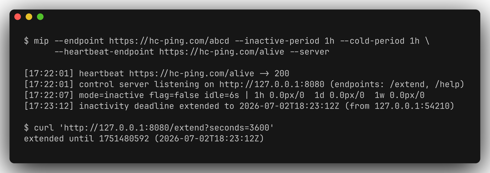
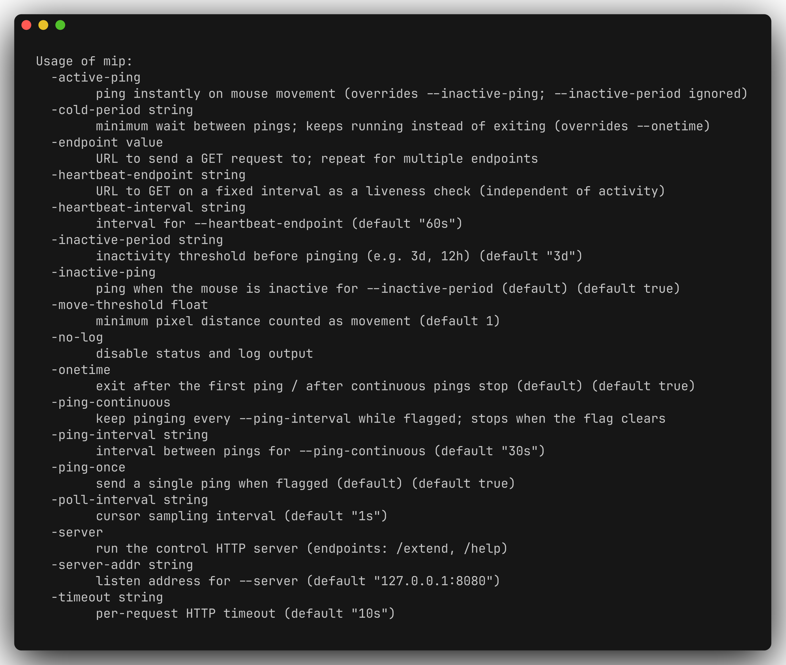

[English](README.md) · [日本語](README-ja.md) · [Deutsch](README-de.md) · Français

# dead-mans-ping (`mip`)

[](https://github.com/didvc/dead-mans-ping/actions/workflows/ci.yml)
[](LICENSE)
[](https://goreportcard.com/report/github.com/didvc/dead-mans-ping)

Un petit CLI multiplateforme (Linux, Windows) écrit en Go, qui envoie des requêtes HTTP `GET` vers un ou plusieurs endpoints selon l’activité de la souris, par exemple un interrupteur d’homme mort qui appelle une URL quand votre machine est restée inactive quelques jours.



Il interroge la position absolue du curseur à intervalle fixe. Cela ne demande aucun privilège élevé et n’installe aucun hook d’entrée global : on peut donc le lancer sans risque en tant qu’utilisateur ordinaire.

- Linux : nécessite une session X11 (`$DISPLAY`). Fonctionne avec les fenêtres XWayland ; Wayland natif n’expose pas, par conception, la position globale du pointeur.
- Windows : utilise `user32!GetCursorPos` via la bibliothèque standard (sans cgo).



## Installation

```sh
# From source (Go 1.25+); installs the `mip` binary:
go install github.com/didvc/dead-mans-ping/cmd/mip@latest
```

Ou récupérez un binaire précompilé pour votre plateforme sur la page [Releases](https://github.com/didvc/dead-mans-ping/releases).

## Compilation

```sh
make            # test + build ./bin/mip for the host
make release    # cross-compile ./bin/mip-linux-amd64 and mip-windows-amd64.exe
make test
```

## Utilisation

```sh
mip --endpoint https://example.com/ping [--endpoint https://backup/ping ...] [options]
```

Toutes les requêtes sont des HTTP `GET`. Au moins un `--endpoint` est requis. Les endpoints doivent être en `http`/`https` avec un hôte ; les requêtes ont un délai d’expiration, un nombre de redirections limité et une lecture du corps limitée en taille.

### Le comportement repose sur trois choix indépendants

Quand déclencher (le « drapeau ») :

| option              | signification                                                       |
| ------------------- | ------------------------------------------------------------------- |
| `--inactive-ping`   | *(par défaut)* drapeau levé quand la souris est immobile ≥ `--inactive-period`|
| `--active-ping`     | drapeau levé dès qu’un mouvement est détecté (`--inactive-period` ignoré) |

Comment envoyer les pings quand le drapeau est levé :

| option              | signification                                                       |
| ------------------- | ------------------------------------------------------------------- |
| `--ping-once`       | *(par défaut)* un seul ping par épisode                             |
| `--ping-continuous` | un ping toutes les `--ping-interval` tant que le drapeau est levé ; s’arrête quand il retombe |

Cycle de vie :

| option              | signification                                                       |
| ------------------- | ------------------------------------------------------------------- |
| `--onetime`         | *(par défaut)* quitter après le premier ping ou après la fin des pings continus |
| `--cold-period D`   | continuer à tourner ; imposer un écart minimal `D` entre les pings (prioritaire sur `--onetime`) |

### Toutes les options

| option                | défaut  | description                                        |
| --------------------- | ------- | -------------------------------------------------- |
| `--endpoint URL`         | -                 | cible des pings d’activité ; à répéter pour plusieurs |
| `--inactive-period D`    | `3d`              | seuil d’inactivité pour `--inactive-ping`    |
| `--ping-interval D`      | `30s`             | intervalle de répétition pour `--ping-continuous` |
| `--cold-period D`        | unset             | écart minimal entre les pings (implique de ne pas être en `--onetime`) |
| `--heartbeat-endpoint URL` | unset           | URL de présence, GET à intervalle fixe (voir plus bas) |
| `--heartbeat-interval D` | `60s`             | intervalle pour `--heartbeat-endpoint`       |
| `--server`               | off               | lancer le serveur HTTP de contrôle (voir plus bas) |
| `--server-addr HOST:PORT`| `127.0.0.1:8080`  | adresse d’écoute pour `--server`             |
| `--poll-interval D`      | `1s`              | intervalle d’échantillonnage du curseur      |
| `--move-threshold N`     | `1.0`             | distance minimale en pixels comptée comme un mouvement |
| `--timeout D`            | `10s`             | délai HTTP par requête                       |
| `--no-log`               | off               | désactiver la ligne d’état et le journal d’événements |

## Heartbeat (présence)

`--heartbeat-endpoint` est une boucle distincte des pings d’activité : elle appelle son URL en GET toutes les `--heartbeat-interval` (dès le démarrage), quelle que soit l’activité de la souris, pour qu’un moniteur externe sache que le processus tourne encore. Elle ne partage jamais d’endpoint ni de rythme avec les pings d’activité.

```sh
mip --endpoint https://example.com/idle \
    --heartbeat-endpoint https://hc-ping.com/alive --heartbeat-interval 5m
```

## Serveur de contrôle

Avec `--server`, une interface HTTP de contrôle est lancée (liée à `127.0.0.1:8080` par défaut) :

| endpoint                    | effet                                                         |
| --------------------------- | ------------------------------------------------------------- |
| `GET /extend?seconds=<N>`   | repousser l’échéance d’inactivité de N secondes (cumulable)   |
| `GET /extend?until=<unix>`  | repousser l’échéance d’inactivité jusqu’à un horodatage Unix   |
| `GET /help`                 | texte d’aide                                                  |

`/extend` retarde le moment où un `--inactive-ping` se déclenche : un « je suis toujours là » à distance, sans toucher à la souris. L’échéance ne fait qu’avancer ; indiquez exactement l’un de `seconds`/`until`. Comme cela peut neutraliser un interrupteur d’homme mort, le serveur n’écoute que sur localhost par défaut ; ne l’exposez que derrière votre propre authentification ou proxy.

```sh
mip --endpoint https://example.com/idle --inactive-period 1h --cold-period 1h --server
# from elsewhere on the box:
curl 'http://127.0.0.1:8080/extend?seconds=3600'   # hold off for another hour
```



Les durées acceptent `s`, `m`, `h`, ainsi que `d` (jours) et `w` (semaines), par ex. `3d`, `1w`, `1d12h`.

### Ligne d’état

Sauf si `--no-log` est indiqué, une ligne d’état en direct affiche le mode actuel, le temps d’inactivité et un résumé des mouvements (distance totale en pixels et nombre de mouvements) sur la dernière heure, le dernier jour et la dernière semaine :

```
[14:22:07] mode=inactive flag=false idle=1m3s | 1h 4821.5px/142 1d 4821.5px/142 1w 4821.5px/142
```

Les mesures de mouvement sont regroupées par tranches d’une minute dans un tampon circulaire d’une semaine, si bien que la mémoire utilisée reste constante quelle que soit la durée de fonctionnement.

## Exemples

```sh
# Dead-man's switch: ping once after 3 days idle, then exit (all defaults).
mip --endpoint https://hc-ping.com/UUID

# Heartbeat: while idle ≥ 1h, ping every 5 minutes; keep running,
# no more than one ping per 5 minutes.
mip --inactive-period 1h --ping-continuous --ping-interval 5m \
    --cold-period 5m --endpoint https://example.com/idle

# Presence beacon: ping the instant the mouse moves, at most every 30s.
mip --active-ping --cold-period 30s --endpoint https://example.com/active
```

## Référence du CLI

Toutes les options (`mip --help`) :



## Confidentialité

L’outil ne lit que les coordonnées du curseur à l’écran, en mémoire, pour détecter les mouvements : pas de frappes clavier, pas de titres de fenêtre, pas de contenu d’écran. Rien n’est enregistré sur le disque et il n’y a aucune télémétrie. Le seul trafic réseau est constitué des requêtes GET que vous configurez via `--endpoint` et `--heartbeat-endpoint`.

## Licence

Distribué sous [licence Apache 2.0](LICENSE).

<!-- BEGIN gh-mutual-linking -->

---

### Related projects

- [chatnote](https://github.com/didvc/chatnote): Self-hosted note-to-self chatrooms. Privacy-first by design, infinite rooms, Markdown, ephemeral/incognito room types, image uploads, tags, JSON import/export. Astro SSR + SQLite.
- [visited](https://github.com/didvc/visited): Securely collect browsing history over browsers.
<!-- END gh-mutual-linking -->