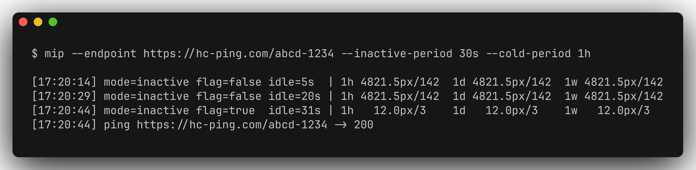
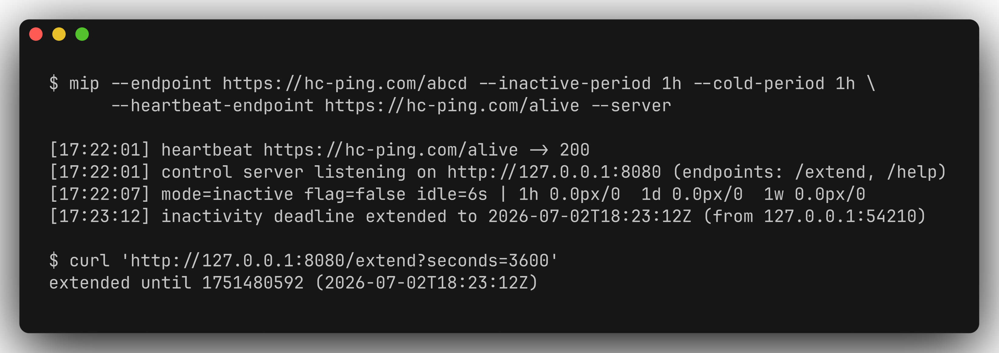
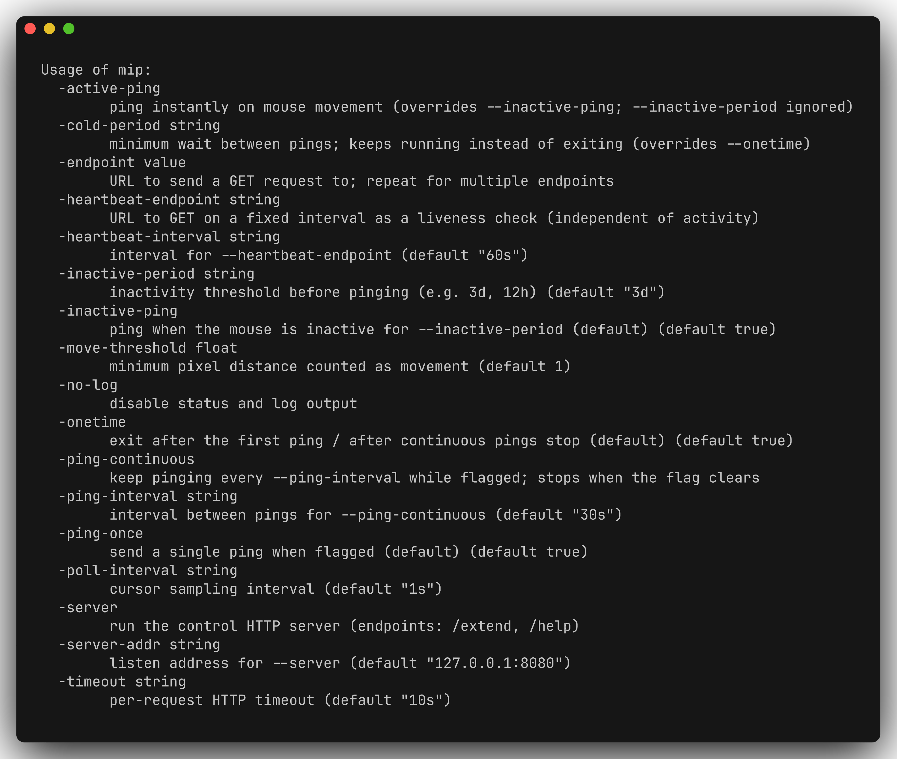

# dead-mans-ping (`mip`)

[](https://github.com/didvc/dead-mans-ping/actions/workflows/ci.yml)
[](LICENSE)
[](https://goreportcard.com/report/github.com/didvc/dead-mans-ping)

A small cross-platform (Linux, Windows) Go CLI that sends HTTP `GET` requests
to one or more endpoints based on **mouse-movement activity** — for example, a
dead-man's switch that pings a URL after your machine has been idle for a few
days.

It works by **polling the absolute cursor position** at a fixed interval. This
needs no elevated privileges and installs no global input hooks, so it is safe
to run as an ordinary user.

- **Linux:** requires an X11 session (`$DISPLAY`). Works with XWayland windows;
  native Wayland does not expose a global pointer position by design.
- **Windows:** uses `user32!GetCursorPos` via the standard library (no cgo).



## Install

```sh
# From source (Go 1.25+); installs the `mip` binary:
go install github.com/didvc/dead-mans-ping/cmd/mip@latest
```

Or grab a prebuilt binary for your platform from the
[Releases](https://github.com/didvc/dead-mans-ping/releases) page.

## Build

```sh
make            # test + build ./bin/mip for the host
make release    # cross-compile ./bin/mip-linux-amd64 and mip-windows-amd64.exe
make test
```

## Usage

```sh
mip --endpoint https://example.com/ping [--endpoint https://backup/ping ...] [options]
```

All requests are HTTP `GET`. At least one `--endpoint` is required. Endpoints
must be `http`/`https` with a host; requests use a timeout, capped redirects,
and a size-limited body read.

### Behaviour is three orthogonal choices

**When to fire (the "flag"):**

| flag                | meaning                                                             |
| ------------------- | ------------------------------------------------------------------- |
| `--inactive-ping`   | *(default)* flag raised once the mouse is idle ≥ `--inactive-period`|
| `--active-ping`     | flag raised the instant any movement is seen (`--inactive-period` ignored) |

**How to ping while flagged:**

| flag                | meaning                                                             |
| ------------------- | ------------------------------------------------------------------- |
| `--ping-once`       | *(default)* one ping per flagged episode                            |
| `--ping-continuous` | ping every `--ping-interval` while flagged; stops when the flag clears |

**Lifecycle:**

| flag                | meaning                                                             |
| ------------------- | ------------------------------------------------------------------- |
| `--onetime`         | *(default)* exit after the first ping / after continuous pings stop |
| `--cold-period D`   | keep running; enforce a minimum gap `D` between pings (overrides `--onetime`) |

### All options

| flag                  | default | description                                        |
| --------------------- | ------- | -------------------------------------------------- |
| `--endpoint URL`         | —                 | activity-ping target; repeat for multiple    |
| `--inactive-period D`    | `3d`              | idle threshold for `--inactive-ping`         |
| `--ping-interval D`      | `30s`             | repeat interval for `--ping-continuous`      |
| `--cold-period D`        | unset             | minimum gap between pings (implies not `--onetime`) |
| `--heartbeat-endpoint URL` | unset           | liveness URL, GET on a fixed interval (see below) |
| `--heartbeat-interval D` | `60s`             | interval for `--heartbeat-endpoint`          |
| `--server`               | off               | run the control HTTP server (see below)      |
| `--server-addr HOST:PORT`| `127.0.0.1:8080`  | listen address for `--server`                |
| `--poll-interval D`      | `1s`              | cursor sampling interval                     |
| `--move-threshold N`     | `1.0`             | minimum pixel distance counted as movement   |
| `--timeout D`            | `10s`             | per-request HTTP timeout                     |
| `--no-log`               | off               | disable the status line and event log        |

## Heartbeat (liveness)

`--heartbeat-endpoint` is a **separate** loop from the activity pings: it GETs
its URL every `--heartbeat-interval` (starting immediately) regardless of mouse
activity, so an external monitor can tell this process is still alive. It never
shares an endpoint or timing with the activity pings.

```sh
mip --endpoint https://example.com/idle \
    --heartbeat-endpoint https://hc-ping.com/alive --heartbeat-interval 5m
```

## Control server

With `--server`, an HTTP control surface is started (bound to `127.0.0.1:8080`
by default):

| endpoint                    | effect                                                        |
| --------------------------- | ------------------------------------------------------------- |
| `GET /extend?seconds=<N>`   | push the inactivity deadline forward by N seconds (accumulates) |
| `GET /extend?until=<unix>`  | push the inactivity deadline to an absolute unix timestamp     |
| `GET /help`                 | usage text                                                    |

`/extend` postpones the moment an `--inactive-ping` fires — a remote "I'm still
here" that works without touching the mouse. The deadline only ever moves
forward; provide exactly one of `seconds`/`until`. Because this can defeat a
dead-man's switch, the server binds to localhost by default — only expose it
behind your own auth/proxy.

```sh
mip --endpoint https://example.com/idle --inactive-period 1h --cold-period 1h --server
# from elsewhere on the box:
curl 'http://127.0.0.1:8080/extend?seconds=3600'   # hold off for another hour
```



Durations accept `s`, `m`, `h`, plus `d` (days) and `w` (weeks), e.g. `3d`,
`1w`, `1d12h`.

### Status line

Unless `--no-log` is given, a live status line shows the current mode, idle
time, and a movement summary (total pixel distance and move count) over the
last **1h / 1d / 1w**:

```
[14:22:07] mode=inactive flag=false idle=1m3s | 1h 4821.5px/142 1d 4821.5px/142 1w 4821.5px/142
```

Movement metrics are aggregated into one-minute buckets held in a one-week ring
buffer, so memory use stays constant no matter how long the process runs.

## Examples

```sh
# Dead-man's switch: ping once after 3 days idle, then exit (all defaults).
mip --endpoint https://hc-ping.com/UUID

# Heartbeat: while idle ≥ 1h, ping every 5 minutes; keep running,
# no more than one ping per 5 minutes.
mip --inactive-period 1h --ping-continuous --ping-interval 5m \
    --cold-period 5m --endpoint https://example.com/idle

# Presence beacon: ping the instant the mouse moves, at most every 30s.
mip --active-ping --cold-period 30s --endpoint https://example.com/active
```

## CLI reference

All flags (`mip --help`):



## Privacy

The tool reads only the cursor's screen coordinates, in memory, to detect
movement — no keystrokes, no window titles, no screen contents. Nothing is
persisted to disk and there is no telemetry. The only network traffic is the
GET requests you configure via `--endpoint` and `--heartbeat-endpoint`.

## License

Licensed under the [Apache License 2.0](LICENSE).
